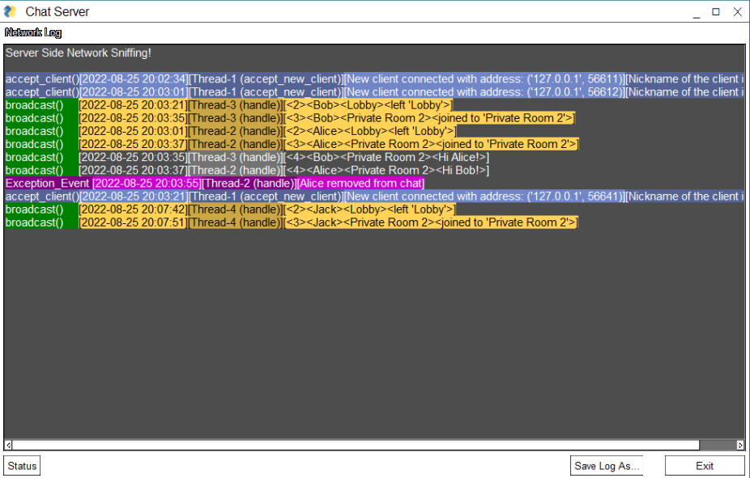
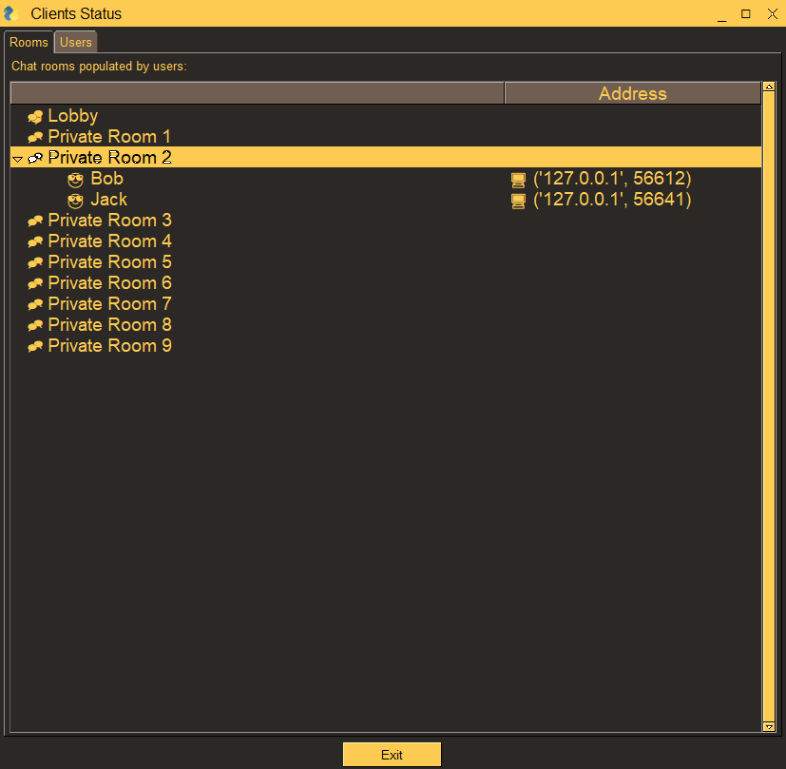

# Chat Rooms Project

> Chat Rooms is an exercise in the Python Software Development Workshop. (Based on [PySimpleGUI](https://github.com/PySimpleGUI) framework)

## Description

Chat Rooms is a basic asynchronous TCP/IP app. The chat server creates a server socket, binds it to a port, and listens for incoming connections. The chat server allows multiple clients to connect to it and chat with each other in different rooms.

* The server receives a message from a client, broadcasts it to all clients, and then sends an event to the GUI.
* The server accepts new clients and starts a new thread for each one. It also stores the client's information in a dictionary called status_dict.
* The server has two loops, one for accepting new clients and another for broadcasting the messages. The first loop continuously accepts new clients until MAX_CLIENTS is reached.
* Initially all clients are joined to the room called "Lobby".

## Installation

There is none. 😊 Just download the release and run it.

## Requirements

```shell
pip install PySimpleGUI
```

## Run

```shell
$ python chat_server_ui.py

$ python chat_client_ui.py
$ python chat_client_ui.py
...
```

## Screenshots

- Chat Client

  
- Chat Server

  
- Clients Status

  

## Author

Vadim M - vasja34@gmail.com

## Credits

- GitHub: [PySimpleGUI](https://github.com/PySimpleGUI)
- Website: [PySimpleGUI.org](https://PySimpleGUI.org)

## License

This software is licensed under the [MIT](LICENSE) License.
